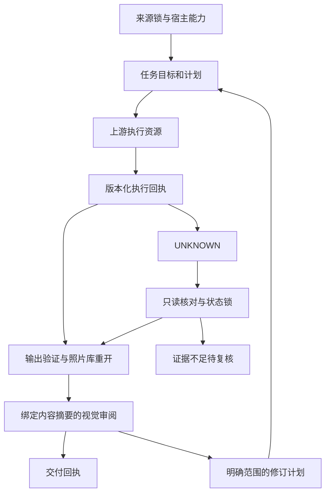

## Context

2026-10-08 基线：插件 0.1.0-dev.1，无 Git/远端/正式发行；六项技能共 36 文件，与本地技能源和 candidate-source.json 一致。插件自己的 1 项测试通过；Dreamina 的 portable 校验器接受当前根清单，宿主实际加载仍 NOT_RUN。

已复现 candidate-source 中 releaseTag/sourceProject/sourceVersion 被分别篡改后仍通过校验；LICENSE 引用缺失文件；文档提及的同步脚本实际位于技能源库。技能执行层超时缺陷由 S-3 负责，本项目不得复制第二份修复。动机见 [proposal](proposal.md)。

## Goals / Non-Goals

**Goals:** 建立可信来源、任务核对、产物审阅及可证明的宿主交付。优先复用经过接口验收的技能资源。

**Non-Goals:** 不把根清单最小化当作格式错误；不要求所有宿主文件一次齐备；不为形式增加 MCP 服务；不复制 Dreamina 积分/远程 submitId 机制；不承诺无限自动修图或 exactly-once。

## Decisions

### D1 来源归属与分发模型

六项上游技能是受管快照，本地 Harness 若确需独立技能入口，必须在插件本地清单明确声明并与来源技能分开校验；不能暗中将其算成第七个上游技能。初期优先使用六技能路由加本地控制器，不把每个控制命令变成技能。

候选锁包含明确 local-unpublished-candidate、sourceProject、sourceVersion 与文件摘要，releaseTag 必须为空。发行锁新增仓库、不可变版本 tag、解析后的 commit、包内容摘要及校验方法；验证者检查实际 tag/commit 对应，不以字符串长度充当发行验证。源码、插件和原生版本分别有语义，不强制三者版本号相等。

维护端继续调用技能源库同步器，插件文档给出正确路径与职责；用户运行插件不需要技能源仓库。普通同步拒绝覆盖用户漂移与源删除，授权的发行升级另有预检和迁移记录，不静默改写来源。

### D2 持久任务与恢复

插件消费 S-3.4 执行回执，不重写命令参数或原生结果解析。任务状态建议使用 `PLANNED → RUNNING → VERIFYING → AWAITING_REVIEW → COMPLETED`；失败分支为 `FAILED_OR_PARTIAL`、`UNKNOWN` 和 `BLOCKED`，停止请求与是否已终止分开记录。枚举需在实施前随 Schema 一次冻结。

状态绑定 taskId、runId、计划摘要、实际照片库身份、输入、输出根和步骤回执引用。原子状态保存与任务排他锁并用；原生库锁继续由 LightCraft 提供，插件锁不替代它。输出目标可使用规范化路径及文件身份做冲突检查。

UNKNOWN 的核对读取已知进程身份、逐步骤回执、照片库重开/设置和导出文件；PID 单独不足以证明进程身份或终止。没有足够证据时停留待复核，禁止启动同计划。已确定未执行的后续步骤可形成显式新计划，绑定旧结果，仍需检查现有授权与输入状态。

### D3 产物与审阅

S-4.5 产物事实描述真实文件；插件关联这些事实与任务目标、修订号、重开结果和视觉审阅。确定性检查负责格式、尺寸、解码、位深、色彩元数据与目录边界；视觉审阅负责曝光、色偏、肤色、噪点、裁切、局部修改是否符合用户要求。不存在通用“更好看”阈值，也不把 SHA-256 相符当作质量合格。

审阅 request/receipt 绑定目标、原图、候选、显影设置、rubricVersion；变更使旧审阅失效。人工与宿主模型均可成为注明身份的审阅来源，不要求额外模型或子 Agent。默认每次仅提出明确修订，不自动无限循环；重启不丢失修订次数和任务约束。

### D4 首个宿主与测试

默认首个目标为当前协作环境 Codex + macOS arm64。实施前从当前宿主契约验证所需兼容清单与路径，最小根清单已通过的事实保留；不要复制 Dreamina 的全部扩展目录。hooks 若新增仅做轻量提示/包完整性检查，不自动安装、扫描用户素材或阻断无关会话。

测试按候选结构、契约与故障注入、固定原生、宿主加载与自然语言路由、视觉、平台、发布分层。当前仅承诺 macOS arm64 原生范围；Python 3.11/3.12/3.13 可做离线矩阵，但不由此推导 Windows/Linux 原生支持。

### D5 依赖与共享接口

| 本项目任务 | 前置 | 接口 |
|---|---|---|
| P-2.1 | S-3.4 | 能力快照、执行回执 Schema 与错误/未知样例 |
| P-3.2 | S-4.5 | 独立文件验证后的产物事实 |
| P-4.3 | S-4.1、S-5.4 | 六技能路由及原生基础闭环 |
| P-5.2 | S-6.2、P-4.4 | 真实来源发行身份与宿主证据 |

本项目不得在 S 任务未完成时用假回执冒充集成通过；mock 仅证明契约和故障分支。

## Risks / Trade-offs

- 任意 CLI 命令可能有未识别副作用 → 默认任务使用已归类流程；未知副作用显式报告，低层透传不宣称受沙箱约束。
- 本地进程被终止而照片库未保存 → 保留 UNKNOWN 与原生保存事实，独立重开核对，不直接重放。
- 更新覆盖缓存内用户修改 → 校验旧摘要，生成冲突报告，保留副本，不强制同步。
- 审阅随候选变化过期 → 以内容身份绑定，重开或导出改变后重新验证受影响范围。
- 发布自动化具备外部写入权限 → 仅在明确 Git/远端/发布授权后执行，离线 CI 不安装用户宿主或触发生成。

## Migration Plan

先校验当前候选身份并补失败测试，再消费 S-3.4 新契约，随后实现状态/产物/审阅，最后接入宿主与发行。旧状态只读展示，不删除或伪造新回执；无法迁移保留原文件及原因。新版来源锁和状态采用版本协商，回滚保留原生照片库和全部证据，不将新回执交给旧读取器自动执行。快照升级从技能源发布开始，不直接修补插件受管技能。
